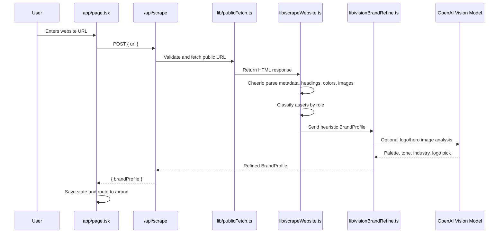
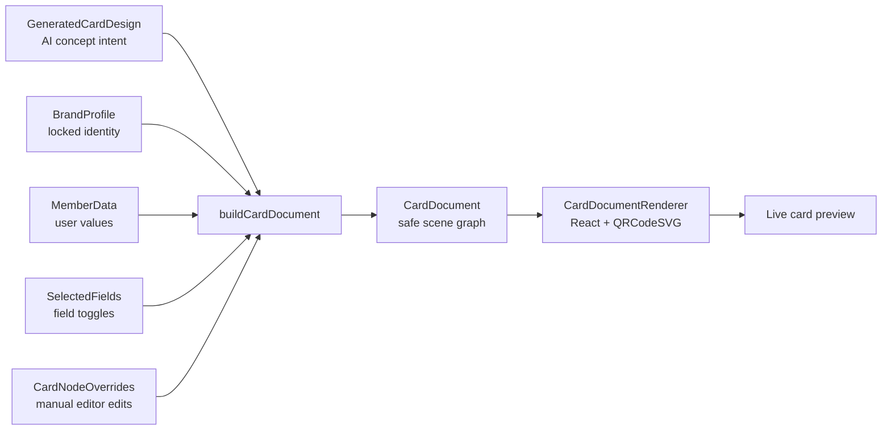

# Romax Pass AI System Architecture

## 1. Product Architecture Summary

Romax Pass AI is a multi-step Next.js application that turns either a business website, a text prompt, or an uploaded card/reference image into a branded digital membership card.

The important architectural idea is separation of responsibility:

- The crawler extracts raw brand signals from a website.
- The Brand Review screen lets the user correct the official identity before AI design begins.
- AI generates structured design intent, not executable React components.
- The deterministic card engine converts that intent into a safe scene graph.
- The React renderer paints the card preview from controlled nodes.
- The export layer creates PNG output and wallet-ready JSON/save links separately.

In the current codebase, AI is used as a brand analyst and art director. The active preview is not raw AI HTML/CSS. It is rendered through `lib/cardDocument.ts` and `components/CardDocumentRenderer.tsx`.

## 2. High-Level System Diagram

```mermaid
flowchart TD
  User[User / Business / Member]

  subgraph Client[Next.js Client Pages]
    Home["/ page\nWebsite, prompt, or card photo input"]
    Brand["/brand\nBrand review and asset correction"]
    Concepts["/concepts\nAI concept selection and refinement"]
    Fields["/fields\nMember field selection"]
    Member["/member\nMember details and card editor"]
    Export["/export\nPNG and wallet export"]
  end

  subgraph State[Browser State]
    LocalStorage["localStorage\nromax-pass-ai-state"]
  end

  subgraph Api[Next.js API Routes]
    ScrapeApi["POST /api/scrape"]
    CustomBrandApi["POST /api/custom-brand"]
    GenerateApi["POST /api/generate-concepts"]
    RefineApi["POST /api/refine-concept"]
    ReviewApi["POST /api/review-design\npresent, not wired into current page flow"]
    WalletGoogle["POST /api/wallet/google"]
    WalletApple["POST /api/wallet/apple"]
  end

  subgraph ServerLib[Server Libraries]
    PublicFetch["lib/publicFetch.ts\nSSRF-safe public fetch"]
    Scraper["lib/scrapeWebsite.ts\nCheerio crawler and asset classifier"]
    VisionBrand["lib/visionBrandRefine.ts\nvision brand refinement"]
    CustomBrand["lib/customBrandProfile.ts\nno-website brand profile creation"]
    Prompts["lib/aiPrompts.ts\nprompt engineering"]
    Schemas["lib/schemas.ts\nZod contracts"]
  end

  subgraph AI[OpenAI Responses API]
    TextModel["OPENAI_MODEL\nconcept/refine text model"]
    VisionModel["OPENAI_VISION_MODEL\nbrand image/custom image/review model"]
  end

  subgraph Render[Preview and Export Engine]
    FieldPolicy["lib/cardFieldPolicy.ts\nfield capacity rules"]
    CardDoc["lib/cardDocument.ts\nsafe card scene graph"]
    Renderer["components/CardDocumentRenderer.tsx\nReact renderer + QR"]
    Editor["components/CardEditor.tsx\nnode overrides"]
    WalletJson["lib/walletExport.ts\nwallet-ready JSON"]
    Png["html-to-image\nPNG capture"]
  end

  User --> Home
  Home --> ScrapeApi
  Home --> CustomBrandApi
  ScrapeApi --> PublicFetch
  PublicFetch --> Scraper
  Scraper --> VisionBrand
  VisionBrand --> VisionModel
  CustomBrandApi --> CustomBrand
  CustomBrand --> VisionModel
  ScrapeApi --> Brand
  CustomBrandApi --> Brand
  Brand --> GenerateApi
  GenerateApi --> Prompts
  GenerateApi --> Schemas
  GenerateApi --> TextModel
  Brand --> LocalStorage
  Concepts --> RefineApi
  RefineApi --> TextModel
  Concepts --> FieldPolicy
  Fields --> FieldPolicy
  Member --> Editor
  Concepts --> CardDoc
  Fields --> CardDoc
  Member --> CardDoc
  Export --> CardDoc
  CardDoc --> Renderer
  Renderer --> Png
  Export --> WalletJson
  Export --> WalletGoogle
  Export --> WalletApple
  WalletGoogle --> Schemas
  WalletApple --> Schemas
  Client --> LocalStorage
```



## 3. User Journey And Page Responsibilities

### Step 1: Input Source

File: `app/page.tsx`

Component: `components/BusinessUrlStep.tsx`

The first screen supports three source modes:

| Mode | User input | API route | Purpose |
| --- | --- | --- | --- |
| Website | Business website URL | `POST /api/scrape` | Crawl a real website and extract brand identity. |
| Prompt | Text prompt plus optional image | `POST /api/custom-brand` | Build a brand profile when the user has no website. |
| Card photo | Uploaded physical membership card or visiting card | `POST /api/custom-brand` | Use the uploaded card as a design reference or near-original digital recreation. |

Uploaded images are compressed client-side through `lib/imageDataUrl.ts` before they are sent to the API or stored.

### Step 2: Brand Review

File: `app/brand/page.tsx`

Component: `components/BrandReviewForm.tsx`

This is the brand-lock checkpoint. The app shows the extracted profile and lets the user correct it before generation:

- Business name
- Primary color
- Brand color usage
- Logo mode: image, text-only, or none
- Logo image candidate
- Hero image candidate
- Background image candidate
- Profile/person image candidate
- Unknown images

The brand profile is saved through `lib/flowState.ts` as a `PassBuilderState`.

### Step 3: Concept Generation And Refinement

File: `app/concepts/page.tsx`

Components:

- `components/ConceptGrid.tsx`
- `components/LivePreviewPanel.tsx`

The Brand Review page sends the confirmed `BrandProfile` to `POST /api/generate-concepts`.

The AI returns exactly eight `GeneratedCardDesign` concept intents. Each concept contains:

- `id`
- `name`
- `description`
- `mood`
- `requiredFields`
- `designTokens`

The user can select a concept or type a refinement prompt. Refinement calls `POST /api/refine-concept`, which regenerates the selected concept intent while preserving brand lock.

### Step 4: Field Selection

File: `app/fields/page.tsx`

Component: `components/FieldSelector.tsx`

The user chooses which member fields should appear. The app enforces layout capacity through `lib/cardFieldPolicy.ts`.

Always locked:

- `name`
- `memberId`
- `qrCode`

Optional fields:

- `photo`
- `decorativeArt`
- `email`
- `phone`
- `tier`
- `expiryDate`
- `dateJoined`
- `studentId`
- `course`
- `loyaltyPoints`

The field selector prevents too many text fields from being enabled for a card shape. Portrait cards fit fewer fields than landscape cards. Photo-led or creative cards also reserve space for media.

### Step 5: Member Details And Manual Editing

File: `app/member/page.tsx`

Components:

- `components/MemberDetailsForm.tsx`
- `components/CardEditor.tsx`

The member enters data for the selected fields. If the selected concept requires a photo or decorative art slot, upload controls appear.

`CardEditor` lets the user click nodes on the preview and apply controlled overrides:

- Text changes
- Font size
- Font weight
- Color
- Alignment
- X/Y/W/H frame values
- Delete/restore some decorative elements
- Delete/restore background image layer

The official identity, QR role, and core fields remain controlled by the renderer.

### Step 6: Export

File: `app/export/page.tsx`

Component: `components/ExportPanel.tsx`

The final page does three things:

- Renders the final preview.
- Creates wallet-ready JSON using `lib/walletExport.ts`.
- Downloads the preview as PNG using `html-to-image`.

Google Wallet save links are attempted through `POST /api/wallet/google` if wallet issuance is configured. Apple/pass2u route infrastructure exists, but the UI currently shows Apple Wallet as coming soon.

## 4. Data Model Architecture

Primary types live in `types/card.ts` and `types/cardDocument.ts`.

### BrandProfile

`BrandProfile` is the canonical brand identity object. It is produced by either the crawler or custom-brand AI flow, then corrected by the user.

Important fields:

- `websiteUrl`
- `businessName`
- `description`
- `industry`
- `logoUrl`
- `logoMode`
- `primaryColor`
- `secondaryColor`
- `brandColorUsage`
- `assets`
- `selectedHeroImageUrl`
- `selectedBackgroundImageUrl`
- `selectedProfileImageUrl`
- `brandTone`
- `confirmed`
- `creationSource`
- `referenceImageMode`
- `designBrief`

### ScrapedAsset

Each scraped or uploaded image is classified as:

- `logoCandidate`
- `heroCandidate`
- `profileCandidate`
- `backgroundCandidate`
- `unknown`

The Brand Review UI groups assets by these roles so the user can correct wrong guesses.

### GeneratedCardDesign

This is the AI concept object. In the current architecture it is design intent, not the final render tree.

Key fields:

- `mood`: official, minimal, premium, playful, creative, cyberpunk, academic, luxury, event, identity
- `requiredFields`: member fields AI recommends
- `designTokens.primaryColor`
- `designTokens.orientation`: landscape or portrait
- `designTokens.backgroundMode`: solid, gradient, image, image-overlay, pattern
- `designTokens.colorUsage`: subtle, balanced, dominant, full
- `designTokens.brandAssetSource`: none, logo, hero, background
- `designTokens.brandAssetTreatment`: standard, logo-watermark, background-emblem, hero-backdrop, side-emblem
- `designTokens.usesPhoto`
- `designTokens.usesDecorativeArt`

Legacy `html` and `css` fields still exist in some schemas for older saved/review flows, but the active renderer uses concept intent.

### CardDocument

`CardDocument` is the deterministic scene graph rendered by React.

It contains:

- A fixed surface size: landscape or portrait
- A background object
- A list of typed nodes
- Text color and primary color tokens

Node types:

- `panel`
- `text`
- `field`
- `logo`
- `image`
- `qr`

This is the real preview model.

## 5. Website Crawler Architecture

Main files:

- `app/api/scrape/route.ts`
- `lib/scrapeWebsite.ts`
- `lib/publicFetch.ts`
- `lib/visionBrandRefine.ts`
- `lib/url.ts`

Flow:



Crawler extraction includes:

- `title`
- `og:site_name`
- application name metadata
- meta description
- first headings
- favicon
- `theme-color`
- first CSS hex color fallback
- Open Graph logo/image
- Twitter image
- `img` and `source` tags

Asset classification is heuristic. It looks at URL, alt text, class, id, source, width, and height. Then Brand Review gives the user the final say.

Security controls in the crawler:

- Only HTTP/HTTPS URLs are accepted.
- Embedded credentials are rejected.
- Local/private hostnames and IP ranges are blocked.
- DNS results are checked.
- Redirects are followed manually and revalidated.
- HTML responses are capped before Cheerio parsing.
- Non-HTML responses are rejected.

## 6. No-Website Custom Brand Architecture

Main files:

- `app/api/custom-brand/route.ts`
- `lib/customBrandProfile.ts`
- `components/BusinessUrlStep.tsx`
- `lib/imageDataUrl.ts`

This path creates a `BrandProfile` without crawling a website.

Supported modes:

- Prompt-only brand idea
- Prompt plus reference image
- Uploaded physical membership card
- Uploaded visiting card

When OpenAI is configured, the image and prompt are sent to the vision-capable model. The model returns a compact `CustomBrandProfileIntent`, which is converted into a normal `BrandProfile`.

When OpenAI is not configured, the fallback uses keyword heuristics to infer:

- Business name
- Industry
- Color palette
- Logo mode
- Image role
- Tone

Physical card and visiting card inputs are treated as background/design-reference assets unless the image is clearly a clean logo.

## 7. AI And Prompt Engineering Architecture

Main files:

- `lib/aiPrompts.ts`
- `lib/schemas.ts`
- `lib/aiPayload.ts`
- `app/api/generate-concepts/route.ts`
- `app/api/refine-concept/route.ts`
- `app/api/custom-brand/route.ts`
- `app/api/scrape/route.ts`
- `app/api/review-design/route.ts`

The app uses the OpenAI SDK with the Responses API and `zodTextFormat`.

Environment variables:

- `OPENAI_API_KEY`
- `OPENAI_MODEL`
- `OPENAI_VISION_MODEL`

If `OPENAI_VISION_MODEL` is not set, routes fall back to `OPENAI_MODEL`. If `OPENAI_MODEL` is not set, routes default to `gpt-4.1-mini` in the current code.

### AI Task 1: Brand Vision Refinement

System prompt: `brandVisionSystemPrompt`

Input:

- Heuristic business name
- Description
- Headings
- 1-2 candidate logo/hero/background images

Output schema:

- `primaryColor`
- `secondaryColor`
- `brandColorUsage`
- `industry`
- `brandTone`
- `bestLogoAssetId`
- `confidence`

Purpose:

Improve the brittle crawler guesses with pixel-grounded logo and color analysis.

### AI Task 2: Custom Brand Profile

System prompt: `customBrandSystemPrompt`

Input:

- User prompt
- Optional uploaded image
- Source mode: prompt, physical-card, visiting-card
- Reference image mode: match-original or design-inspiration

Output schema:

- `businessName`
- `description`
- `industry`
- `primaryColor`
- `secondaryColor`
- `brandColorUsage`
- `brandTone`
- `logoMode`
- `imageRole`

Purpose:

Let users create a card without a website.

### AI Task 3: Concept Generation

System prompt: `conceptSystemPrompt`

User prompt builder: `buildConceptPrompt`

Input:

- Confirmed `BrandProfile`

Output:

- Exactly eight `GeneratedCardDesign` concept intents

The prompt forces the model to vary:

- Mood
- Color usage
- Orientation
- Brand asset treatment
- Field recommendations
- Use of photo/art slots

It also includes brand-specific creative rules:

- Use a logo as a watermark, emblem, or side crop where appropriate.
- Use hero/background imagery as backdrop when useful.
- For uploaded physical/visiting cards, make one concept a digitized-original direction.
- Never invent a new official logo or mascot.

### AI Task 4: Concept Refinement

System prompt: `conceptSystemPrompt`

User prompt builder: `buildRefinePrompt`

Input:

- Confirmed `BrandProfile`
- Current selected concept
- User instruction

Output:

- Complete replacement concept intent with the same id

Prompt examples it handles:

- Stronger brand color
- Add member photo
- Use logo as background emblem
- Use website imagery as background
- Match uploaded physical card
- Add anime/avatar/actor-like art slot by enabling `decorativeArt`

The model is not asked to create copyrighted characters or real-person likenesses directly. It creates a slot and layout direction for user-provided art.

### AI Task 5: Design Review Endpoint

Route: `app/api/review-design/route.ts`

This endpoint accepts:

- Screenshot data URL
- DOM layout issues
- Current concept
- Brand profile
- Member data
- Selected fields
- Review instruction

It can return:

- `pass`
- `fixed`

Important current implementation note: this endpoint and `lib/layoutChecks.ts` exist, but the current page flow does not automatically call `/api/review-design` after concept generation. The active stability control is the deterministic scene graph plus field capacity policy. If automatic AI visual QA is desired, the UI needs a client loop that renders each concept, screenshots it, runs `runCardLayoutChecks`, calls `/api/review-design`, and stores the repaired concepts.

## 8. Rendering Architecture

Main files:

- `components/TemplateRenderer.tsx`
- `lib/cardDocument.ts`
- `components/CardDocumentRenderer.tsx`
- `types/cardDocument.ts`
- `components/LivePreviewPanel.tsx`
- `components/ConceptGrid.tsx`
- `components/CardEditor.tsx`

Rendering flow:



The renderer does not inject arbitrary AI HTML into the page. `TemplateRenderer` calls `buildCardDocument`, then `CardDocumentRenderer` renders typed nodes.

Why this matters:

- QR nodes stay square.
- Nodes are positioned inside a known card surface.
- Text is clamped and clipped.
- Field toggles rebuild the node list live.
- Member data is resolved through bindings, not string replacement into arbitrary HTML.
- Manual edits are saved as overrides, not as raw CSS.

### Card Archetypes

`lib/cardDocument.ts` maps AI `mood` into layout archetypes:

| AI mood | Render archetype |
| --- | --- |
| official, academic | Official horizontal credential |
| identity | Photo-led identity card |
| premium, luxury | Immersive brand-color pass |
| event, creative, playful, cyberpunk | Poster/access style |
| minimal | Minimal clean pass |

### Brand Asset Treatments

The renderer can use confirmed brand assets as:

- Standard logo
- Logo watermark
- Background emblem
- Hero backdrop
- Side emblem

This is what enables effects like using a sportswear animal mark as a large background emblem or a university logo as an official watermark.

## 9. Field Capacity And Member Data Architecture

Main files:

- `lib/cardFieldPolicy.ts`
- `components/FieldSelector.tsx`
- `components/MemberDetailsForm.tsx`
- `lib/generateMemberId.ts`

The app separates field selection from member data entry.

Field capacity rules:

- Portrait cards: 4 detail text fields.
- Identity/photo-led landscape cards: 3 detail text fields.
- Official landscape cards: 6 detail fields without photo, 4 with photo.
- Other concepts: 4 detail fields.

This prevents the preview from trying to display every possible field on a small card.

Media fields:

- `photo` controls a member-photo upload and node.
- `decorativeArt` controls art/avatar upload and node.

The photo placeholder is visually distinct and shows a photo icon plus `PH` when no photo has been uploaded.

## 10. Export And Wallet Architecture

Main files:

- `app/export/page.tsx`
- `components/ExportPanel.tsx`
- `lib/walletExport.ts`
- `lib/googleWallet.ts`
- `lib/applePass.ts`
- `app/api/wallet/google/route.ts`
- `app/api/wallet/apple/route.ts`

### PNG Export

The export page passes a `previewRef` into `LivePreviewPanel`.

`ExportPanel` dynamically imports `html-to-image` and calls `toPng(previewRef.current, { pixelRatio: 2 })`.

### Wallet-Ready JSON

`createWalletReadyPass` creates a `WalletReadyPass` object:

- `passType`
- `organizationName`
- `description`
- `logoText`
- `foregroundColor`
- `backgroundColor`
- `labelColor`
- QR barcode object
- Primary, secondary, and auxiliary fields

The QR barcode message is generated by `createVerificationMessage`.

Current QR payload is self-asserted JSON:

```json
{
  "type": "membership-verification",
  "business": "...",
  "memberId": "...",
  "website": "..."
}
```

If the card will be trusted by real staff or gates, this should become server-signed verification.

### Google Wallet

The Google route creates a save URL using:

- `GOOGLE_WALLET_ISSUER_ID`
- `GOOGLE_WALLET_SA_EMAIL`
- `GOOGLE_WALLET_SA_PRIVATE_KEY`
- `WALLET_ISSUANCE_TOKEN`

The route requires a bearer token before it signs a wallet JWT.

### Apple/pass2u

The Apple route can call pass2u using:

- `PASS2U_API_KEY`
- `PASS2U_MODEL_ID`
- `WALLET_ISSUANCE_TOKEN`

The UI currently reports Apple Wallet as coming soon.

## 11. State Management Architecture

Main files:

- `lib/flowState.ts`
- `lib/useBuilderState.ts`

The app stores the wizard state in browser localStorage under:

```text
romax-pass-ai-state
```

Stored object:

- `brandProfile`
- `concepts`
- `selectedConceptId`
- `selectedFields`
- `memberData`
- `conceptSource`
- `visualReviewFingerprints`
- `nodeOverrides`

`useBuilderState` enforces route prerequisites:

- `/brand` needs a brand profile.
- `/concepts` needs generated concepts.
- `/fields`, `/member`, and `/export` need a selected concept.

If state is missing, the user is redirected back to the right earlier step.

Storage compaction:

- Data URLs are removed from `brandProfile.images` before persistence.
- Uploads are compressed before storage.
- Quota errors produce a user-facing error.

## 12. Security And Reliability Controls

Important controls already present:

| Area | Control |
| --- | --- |
| Crawler SSRF | `lib/publicFetch.ts` blocks private/local hosts, private IP ranges, embedded credentials, and unsafe redirects. |
| Crawler response size | `readResponseTextWithLimit` caps HTML before Cheerio parsing. |
| Image fetch size | `readResponseBufferWithLimit` caps remote image bytes. |
| API request size | `readJsonWithLimit` caps request bodies before JSON parsing. |
| AI schema safety | OpenAI output is parsed with Zod schemas. |
| AI payload size | `lib/aiPayload.ts` removes/truncates large data URLs in text prompts. |
| Client image DoS | `lib/imageDataUrl.ts` checks source bytes and decoded pixel count. |
| Wallet issuance | Wallet routes require `WALLET_ISSUANCE_TOKEN`. |
| Renderer safety | Active preview uses a controlled React scene graph instead of raw AI HTML injection. |

## 13. External Services And Packages

Runtime/framework:

- Next.js App Router
- React
- TypeScript
- Tailwind CSS

Crawler:

- Cheerio

AI:

- OpenAI SDK
- Responses API
- `zodTextFormat`
- Zod schemas

Preview/export:

- `qrcode.react`
- `html-to-image`

Wallet:

- Node `crypto` for Google Wallet JWT signing
- pass2u HTTP API for Apple-style install links

Icons/UI:

- `lucide-react`

## 14. Current Implementation Notes

These are useful to know when explaining the system:

1. The active concept generator returns eight compact design intents.
2. The active renderer ignores raw AI HTML/CSS and uses `CardDocument`.
3. The older generated HTML/CSS safety helpers still exist in `lib/generatedCardSafety.ts`.
4. `/api/review-design` exists, but there is no active client loop calling it from `/concepts`.
5. Google Wallet can work only when server wallet env vars and a wallet issuance token are configured.
6. Apple Wallet UI is currently a coming-soon stub, even though pass2u route infrastructure exists.
7. The app currently has no user accounts or business ownership verification. Brand lock is a product/UI control, not tenant auth.

## 15. Suggested Presentation Version

If you need to explain the architecture quickly:

1. The user starts with a website URL, a prompt, or a card photo.
2. The server crawler or custom-brand AI creates a `BrandProfile`.
3. The Brand Review screen lets the user correct the locked identity and assets.
4. OpenAI generates eight structured card concepts using brand-aware prompts and Zod schemas.
5. The user selects/refines a concept.
6. Field policy limits visible data fields so the card does not overflow.
7. Member data and image uploads fill the selected fields.
8. A deterministic card document engine renders the preview safely.
9. The editor stores controlled node overrides.
10. Export creates PNG output and wallet-ready JSON, with optional Google Wallet save links.

The core design principle is: AI chooses the art direction; the application owns rendering, data, QR, wallet JSON, and safety.
